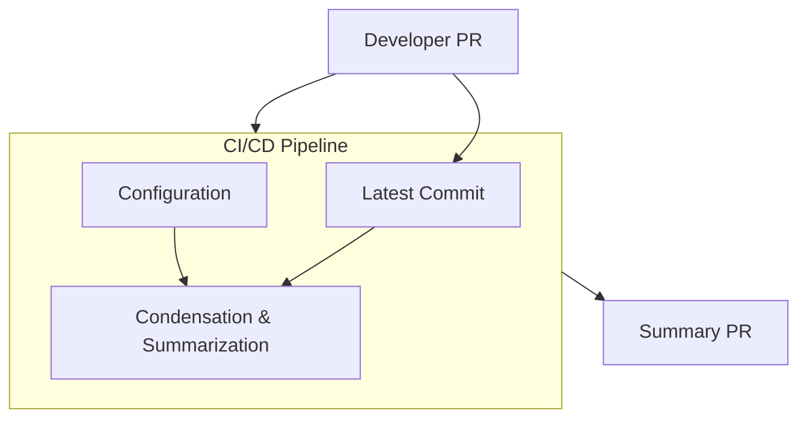

# Continuous Context Update System Specification

## Overview

This document specifies a system designed to continuously update and maintain context documents for a multi-repository software project. The system ensures that developers can quickly understand different parts of the codebase and provides structured data for Large Language Model (LLM) ingestion.

## Components

### 1. Configuration System

- Defines meaningful areas of the system.
- Specifies relevant directories and files for each area.
- Excludes unnecessary files.
- Contains AI summarization prompt settings tailored for each area.
- Written in TOML format for easy parsing and flexibility.

#### Example Configuration in TOML

```toml
[general]
project_name = "MyProject"
default_prompt = "Summarize this section for developer onboarding."

[areas.backend]
description = "Core backend services and APIs"
included_paths = ["src/api", "src/services"]
excluded_paths = ["src/api/tests"]
prompt = "Summarize the backend architecture with a focus on API design."

[areas.frontend]
description = "User interface components"
included_paths = ["src/ui", "src/components"]
excluded_paths = ["src/ui/tests"]
prompt = "Summarize UI component interactions and dependencies."
```

### 2. Condensation Component

- Extracts sections from relevant git repositories based on configuration.
- Flattens them into a structured format (plaintext, markdown, or XML) using a third-party library.
- Produces a single flat file per area of interest, embedding metadata about text origins.
- Passes flat files through an AI summarization process, using tailored prompts.
- Will be packaged as a Nix flake, following a structure similar to timewave-condenser, but modified for CI execution.
- Parses and utilizes the TOML configuration to determine which files to include/exclude and which AI prompt to use.

### 3. Summary Repository

- A separate git repository dedicated to storing summary documents.
- Each area of interest has a corresponding summary document.

### 4. CI/CD Integration with GitHub

On each PR that modifies relevant files:

- Checks out the commit.
- Runs the condensation and summarization pipeline.
- Generates or updates the summary file.
- Opens a corresponding PR in the summary repository.
- If changes occur in the original PR, the summary PR is updated accordingly.

## Automating PR Creation and Updates in the Summary Repository

To enable the CI/CD pipeline to create and update PRs in the summary repository, the following steps need to be implemented:

### GitHub Authentication

- Use a GitHub App or a Personal Access Token (PAT) with permissions to push changes and open PRs in the summary repository.
- Store credentials securely in GitHub Actions Secrets or another CI provider's secret management.

### Cloning and Branch Management

The CI/CD pipeline should:

- Clone the summary repository.
- Create a new branch based on the PR ID or commit hash from the source repository.
- Modify the relevant summary files.

### Committing Changes

Use Git commands within the CI/CD job to:

- Add modified summary files.
- Commit with a descriptive message (e.g., "Update summaries for PR #123").
- Push the new branch to the summary repository.

### Creating or Updating a PR

Use GitHub's API (via gh CLI or curl with jq) to:

- Check if a PR for the branch already exists.
- If it does, update the existing PR with the latest commit.
- If it does not, create a new PR with a title referencing the original PR.

### Handling Subsequent Updates

- If the original PR is modified, the CI/CD job should detect changes and push them to the corresponding branch in the summary repository, triggering an update to the existing PR.

### Merging and Cleanup

- Once the original PR is merged, the corresponding PR in the summary repository should be merged automatically or flagged for manual review.
- After merging, the CI/CD pipeline should delete stale branches.

## System Diagram (Mermaid)



## Implementation Considerations

- **File Flattening**: Use a third-party library to convert repository sections into AI-optimized plaintext or XML.
- **AI Summarization**: Utilize configurable AI prompt settings to generate targeted summaries.
- **GitHub Integration**: Automate PR tracking to ensure summary documents remain synchronized.
- **Nix Flake Packaging**: The condensation component will be implemented as a Nix flake for reproducibility, though its structure will be adapted for CI-based execution.
- **Automated PR Creation**: The CI/CD pipeline will use GitHub API and authentication mechanisms to create and update PRs in the summary repository.
- **TOML Configuration Parsing**: The condensation component will parse and use the TOML configuration to determine which sections of the repository to include in summaries and apply the correct AI prompts.

## Open Questions

### Where should the configuration file(s) live?

- Should each individual repository maintain its own configuration?
- Should there be a central configuration in the summary repository?
- Somewhere else?

### How do we ensure the configuration file remains up to date as the codebase evolves?

- Should developers manually update the configuration file when making structural changes?
- Can AI infer updates to the configuration file based on changes in the codebase?
- What level of automation is desirable vs. introducing unnecessary complexity?

This system enables efficient knowledge dissemination for developers while maintaining up-to-date documentation for LLM-based processing.

